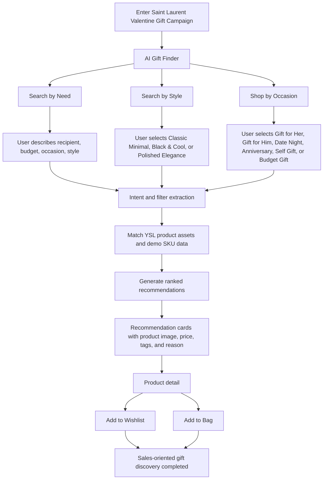
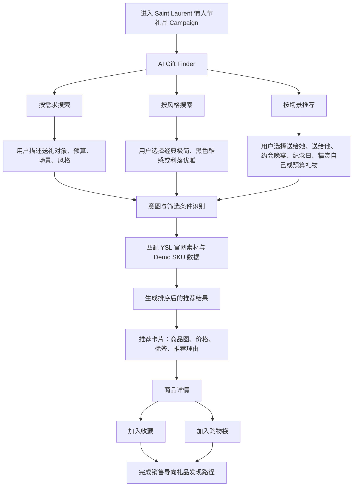

# Saint Laurent Valentine Gift Campaign Demo PRD

Version: v0.6 bilingual, separated by language
Owner: fAIshion Demo Team
Target Event: Kering China Innovation Day 2026
Primary Page: `valentine.html`
Language Structure: English first, Chinese second

---

# English PRD

## 1. Background

Kering has transferred makeup and beauty line operations to L'Oreal. Therefore, this demo should not design makeup, skincare, or beauty gift flows.

The Valentine campaign demo should focus on Saint Laurent fashion commerce categories:

- Bags
- Accessories
- Ready-to-wear
- Shoes

The campaign goal is sales-oriented: help users discover Valentine gifts, understand why a product fits their need, and move toward wishlist or shopping bag actions.

## 2. Product Goal

Build an interactive live demo that lets Kering brand teams experience a complete AI gift-shopping journey:

```text
User need or scenario -> AI understanding -> Saint Laurent product recommendations -> Product detail -> Wishlist or shopping bag
```

The demo should prove that fAIshion can support a luxury holiday campaign by turning brand-owned product data into guided shopping recommendations.

## 3. Target Users

### End Consumer

Users shopping for Valentine gifts for a partner, friend, or themselves.

### Brand and Retail Team

Kering brand stakeholders evaluating whether the solution can support luxury fashion campaign conversion, clienteling, and product discovery.

## 4. Scope

### In Scope

- Valentine gift recommendation journey
- Natural-language product search
- Style-based product discovery
- Scenario-based product recommendation
- Product cards with image, category, price, style tags, and recommendation reason
- Wishlist and shopping bag interactions
- Demo SKU database with 6-8 products
- Luxury-minimal UI aligned with Saint Laurent tone

### Out of Scope

- Makeup
- Skincare
- Beauty gift sets
- Full checkout
- Payment
- User login
- Real inventory sync
- Real AI API integration for the first demo version

## 5. Product Categories

The demo SKU database should include products across the following categories.

| Category | Example Products |
| --- | --- |
| Bags | Tote, shoulder bag, mini bag, clutch |
| Accessories | Sunglasses, belt, jewelry, small leather goods |
| Ready-to-wear | Jacket, blazer, dress, coat |
| Shoes | Heels, boots, loafers, sandals |

Fragrance should not be the core category for this demo. If included, it should be treated only as an optional add-on and not the main gift flow.

### Three User-Facing Demo Styles

The demo should use only three user-facing style tags. These are intentionally simple consumer terms, while the internal YSL style codes remain available for recommendation logic and pitch explanation.

| User-facing Style | Internal YSL Style Code | User Meaning | Product Direction |
| --- | --- | --- | --- |
| Classic Minimal | Iconic Minimal | A safe, refined, low-risk gift with a clean Saint Laurent signature. | Cassandre, Le 5 a 7, Sac de Jour, small leather goods, black or neutral bags |
| Black & Cool | Dark Leather Edge | A more attitude-driven gift with a black, leather, sharp, confident feeling. | Leather pieces, boots, sunglasses, black accessories, evening-ready pieces |
| Polished Elegance | Sharp Tailoring / Power Elegance | A mature and polished style for dinner dates, anniversaries, and elevated dressing. | Tuxedo-inspired jackets, blazers, refined shoes, elegant bags, structured accessories |

## 6. Core Requirements

### A. Basic Search Recommendation

Users can describe what they need in natural language.

Example inputs:

- "Help me choose a Valentine gift for my girlfriend, budget around 5000 RMB, Classic Minimal style."
- "I need a gift for my boyfriend, something Black & Cool but still understated."
- "Recommend a Saint Laurent piece for a Valentine dinner date."

System should extract:

- Recipient
- Budget
- Occasion
- Style preference
- Product category preference, if mentioned

System should return:

- 3-5 recommended products
- Product image
- Product name
- Category
- Price
- Style tags
- Recommendation reason
- CTA: Add to Wishlist / Add to Bag

### B. Style Search Engine

Users can search by aesthetic intent, not only by product name.

Supported user-facing style tags:

| User-facing Style | Internal YSL Style Code | User Meaning | Product Direction |
| --- | --- | --- | --- |
| Classic Minimal | Iconic Minimal | A safe, refined, low-risk gift with a clean Saint Laurent signature. | Cassandre, Le 5 a 7, Sac de Jour, small leather goods, black or neutral bags |
| Black & Cool | Dark Leather Edge | A more attitude-driven gift with a black, leather, sharp, confident feeling. | Leather pieces, boots, sunglasses, black accessories, evening-ready pieces |
| Polished Elegance | Sharp Tailoring / Power Elegance | A mature and polished style for dinner dates, anniversaries, and elevated dressing. | Tuxedo-inspired jackets, blazers, refined shoes, elegant bags, structured accessories |

Rationale:

- The front-end UI should use simple consumer language, not fashion-industry wording.
- Internal YSL style codes can still guide recommendation logic and pitch storytelling.
- Three tags are enough for the demo because they are easier to understand, easier to present, and still cover Saint Laurent's core visual world.

Example:

User selects `Classic Minimal` + `Gift for Her`.

Expected output:

- Black or neutral bag
- Refined accessory
- Elegant shoe or ready-to-wear piece
- Recommendation copy explaining why each item matches the style

### C. Scenario Product Recommendation

Users can browse recommendations by Valentine-related scenarios.

Required scenarios:

- Valentine Gift for Her
- Valentine Gift for Him
- Date Night Outfit
- Anniversary Gift
- Self Gift
- Luxury Gift Under Budget

Optional filters:

- Recipient: Her / Him / Neutral
- Age range: 20s / 30s / 40s
- Budget: Under RMB 3,000 / RMB 3,000-8,000 / RMB 8,000+
- Style: Classic Minimal / Black & Cool / Polished Elegance

Expected output:

- 1 hero product
- 2-4 supporting products
- Clear sales-oriented recommendation reason
- Wishlist and shopping bag actions

## 7. User Journey

1. User lands on the Valentine Gift Campaign page.
2. User sees the AI Gift Finder as the primary interaction.
3. User chooses one of three paths: Search by Need, Search by Style, or Shop by Occasion.
4. System collects or infers recipient, occasion, budget, and style.
5. System recommends products from bags, accessories, ready-to-wear, and shoes.
6. User opens a product detail card.
7. User adds one or more products to wishlist or shopping bag.

### User Flow Diagram



## 8. Page Structure

### Hero / First Screen

- Campaign title: Saint Laurent Valentine Gift Edit
- AI Gift Finder search bar
- Three entry points: Search by Need, Search by Style, Shop by Occasion
- Visual should be product-led, not video-only.

### Gift Categories

Show four category entry points:

- Bags
- Accessories
- Ready-to-wear
- Shoes

### AI Recommendation Results

Display product cards generated from the selected flow or user input.

Each card includes:

- Product image
- Product name
- Category
- Price
- Style tags
- Recommendation reason
- Add to Wishlist
- Add to Bag

### Product Detail

Includes:

- Large product image
- Product name
- Price
- Materials
- Styling recommendation
- Gift recommendation reason
- CTA actions

## 9. Recommendation Logic for Demo V0.1

The first demo does not require a live AI model. It can use deterministic matching rules for stability and speed.

Recommended data fields:

```js
{
  id: "sl-bag-001",
  name: "Le 5 a 7 Shoulder Bag",
  category: "Bags",
  price: 22500,
  image: "...",
  tags: ["classic-minimal", "iconic-minimal", "gift-for-her", "evening"],
  occasions: ["valentine", "anniversary", "date-night"],
  recipients: ["her", "neutral"],
  reason: "A compact Saint Laurent signature bag that feels personal, polished, and easy to wear beyond Valentine's Day."
}
```

Matching rules:

1. Match occasion first.
2. Then match recipient.
3. Then match budget.
4. Then match style tags.
5. If no exact result exists, return the closest category match with explanation.

## 10. UX and Visual Direction

Design principles:

- Luxury minimal
- Black, white, neutral beige, restrained gold accents
- Product-first composition
- Clear sales actions
- Fast, booth-ready interaction

Avoid:

- Rose icon as primary UI
- Heavy red or pink Valentine graphics
- Makeup or beauty gift framing
- Long paragraphs inside the interface
- Video-only demo experience

The experience should feel like a Saint Laurent digital sales associate, not a generic chatbot.

## 11. Demo Success Criteria

- A first-time user can complete a recommendation path without guidance.
- All three paths, A/B/C, are usable.
- Recommendations only include bags, accessories, ready-to-wear, and shoes.
- User can add recommended products to wishlist or shopping bag.
- The page is fast enough for booth usage.
- The visual design feels luxury, minimal, and Saint Laurent-aligned.
- The demo clearly shows end-to-end logic for Kering reviewers.

## 12. First Build Checklist

- Replace rose-based chat button with minimal AI Gift Finder entry.
- Rewrite hero section around Valentine Gift Edit and sales discovery.
- Add three primary paths: need, style, occasion.
- Create 6-8 product records across allowed categories.
- Replace generic chatbot responses with product recommendation outputs.
- Add recommendation result section.
- Ensure wishlist and shopping bag work from recommendation cards.
- Remove makeup, skincare, beauty gift, and rose-led campaign language.
- Test desktop and mobile usability.

## 13. Milestones

| Date | Deliverable |
| --- | --- |
| June 5, 2026 | First rehearsal: basic live demo path and draft pitch |
| June 16, 2026 | Complete demo and final pitch deck |
| July 3, 2026 | Booth-ready interactive demo |

## 14. Design References and Product Assets

### Brunello Cucinelli AI Reference

Reference folder: `references/brunello-cucinelli-ai/`

Use Brunello Cucinelli AI as the UI/UX workflow reference only.

Reference points:

- AI assistant entry point and discovery workflow
- Prompt-driven product exploration
- Guided recommendation path from user intent to product results

Do not copy:

- Brunello Cucinelli brand identity
- Brunello Cucinelli typography, palette, imagery, product style, or brand tone

### Saint Laurent China Reference

Reference folder: `references/saint-laurent-cn/`

Use Saint Laurent China official website as the primary brand, visual, and commerce reference.

Reference points:

- Typography, header, footer, navigation, spacing, and layout rhythm
- Luxury-minimal black-and-white visual tone
- Official product imagery and commerce category presentation
- Product categories: bags, accessories, ready-to-wear, shoes

Implementation principle:

```text
BC defines the interaction logic. YSL defines the brand expression.
```

### Saint Laurent Official Product Assets

Asset folder: `ysl官网素材/`

Use the saved Saint Laurent China official website product-page assets as the primary product image and category reference for the Valentine Gift Campaign demo.

Asset structure:

| Folder | Included Product Pages | Demo Usage |
| --- | --- | --- |
| `ysl官网素材/女/` | Homepage, ready-to-wear, shoes, accessories, small leather goods | Gift for Her, date-night outfit, self gift |
| `ysl官网素材/男/` | Summer 26 men, travel bags, shoes, accessories, small leather goods | Gift for Him, understated luxury, classic accessories |

Required usage:

- Product imagery should come from `ysl官网素材/` when building recommendation cards, category tiles, and product detail modules.
- Product selection should stay within bags, accessories, ready-to-wear, shoes, and small leather goods.
- Men's and women's journeys should use the corresponding official asset folders to preserve product relevance.
- Product names, visual hierarchy, spacing, product-card rhythm, header, and footer should align with Saint Laurent official site references.

Do not use:

- Makeup, skincare, beauty gift sets, or fragrance-led gifting as the main flow.
- Brunello Cucinelli product imagery, color palette, typography, or brand tone in the final YSL demo UI.
- Generic stock images when an official YSL product asset is available.

Product asset mapping:

| Demo Category | Recommended Asset Source |
| --- | --- |
| Bags | Men's travel bags and women's official homepage/category imagery |
| Accessories | Men's and women's accessories folders |
| Ready-to-wear | Women's ready-to-wear and men's Summer 26 collection |
| Shoes | Men's and women's shoes folders |
| Small leather goods | Men's and women's small leather goods folders |

---

# 中文 PRD

## 1. 项目背景

Kering 已将彩妆和美妆线运营转移至 L'Oreal。因此，本次 Demo 不设计 makeup、skincare 或 beauty gift 相关流程。

本次情人节 Campaign Demo 应聚焦 Saint Laurent 时尚电商品类：

- 包袋
- 配饰
- 成衣
- 鞋履

本次 Campaign 的目标是销售转化导向：帮助用户发现适合作为情人节礼物的商品，理解推荐理由，并完成收藏或加入购物袋等购买前动作。

## 2. 产品目标

构建一个可现场操作的交互式 Live Demo，让 Kering 品牌团队体验完整的 AI 礼品导购路径：

```text
用户需求或场景 -> AI 理解 -> Saint Laurent 商品推荐 -> 商品详情 -> 收藏或加入购物袋
```

Demo 需要证明 fAIshion 可以将品牌商品数据转化为节日 Campaign 中可落地的导购推荐体验，帮助奢侈品牌提升商品发现和销售转化。

## 3. 目标用户

### 终端消费者

为伴侣、朋友或自己选购情人节礼物的消费者。

### 品牌与零售团队

评估该方案是否能支持奢侈品节日 Campaign 转化、客户经营和商品发现的 Kering 品牌相关团队。

## 4. 项目范围

### 本期范围

- 情人节礼品推荐路径
- 自然语言商品搜索
- 基于风格的商品发现
- 基于场景的商品推荐
- 包含图片、品类、价格、风格标签和推荐理由的商品卡片
- 收藏和购物袋交互
- 包含 6-8 个商品的 Demo SKU 数据库
- 符合 Saint Laurent 调性的极简奢侈品 UI

### 不在本期范围

- 彩妆
- 护肤
- 美妆礼盒
- 完整结账流程
- 支付
- 用户登录
- 实时库存同步
- 第一版 Demo 暂不接入真实 AI API

## 5. 商品品类

Demo SKU 数据库应覆盖以下商品品类。

| 品类 | 示例商品 |
| --- | --- |
| 包袋 | 托特包、肩背包、迷你包、手拿包 |
| 配饰 | 墨镜、皮带、首饰、小皮具 |
| 成衣 | 夹克、西装外套、连衣裙、大衣 |
| 鞋履 | 高跟鞋、靴子、乐福鞋、凉鞋 |

香水不作为本次 Demo 的核心品类。如需保留，可作为附加推荐出现，但不应成为主礼品路径。

### 三个用户可理解的 Demo 风格

Demo 前台只使用三个用户可理解的风格标签。这三个词应是用户能马上理解的消费语言；内部 YSL 风格代码仍可用于推荐逻辑、商品归类和 Pitch 讲述。

| 用户看到的风格 | 内部 YSL 风格代码 | 用户理解 | 商品方向 |
| --- | --- | --- | --- |
| 经典极简 | Iconic Minimal | 安全、精致、不容易出错，适合作为低调有质感的礼物。 | Cassandre、Le 5 a 7、Sac de Jour、小皮具、黑色或中性色包袋 |
| 黑色酷感 | Dark Leather Edge | 更有态度，带有黑色、皮革、利落和自信的感觉。 | 皮革单品、靴子、墨镜、黑色配饰、适合夜晚场景的单品 |
| 利落优雅 | Sharp Tailoring / Power Elegance | 更成熟、精致，适合约会晚餐、纪念日和正式穿搭场景。 | 西装外套、tuxedo 灵感剪裁、精致鞋履、优雅包袋、结构感配饰 |

## 6. 核心需求

### A. 基础搜索推荐

用户可以用自然语言描述自己的送礼需求。

示例输入：

- “帮我选一个送女朋友的情人节礼物，预算 5000 元左右，风格经典极简。”
- “我想给男朋友选一件黑色酷感但低调的礼物。”
- “推荐一个适合情人节晚餐约会的 Saint Laurent 单品。”

系统需要识别：

- 送礼对象
- 预算
- 场景
- 风格偏好
- 用户提到的商品品类偏好

系统需要返回：

- 3-5 个推荐商品
- 商品图片
- 商品名称
- 商品品类
- 价格
- 风格标签
- 推荐理由
- CTA：加入收藏 / 加入购物袋

### B. 风格搜索引擎

用户不仅可以按商品名称搜索，也可以通过审美意图和风格关键词查找商品。

支持的用户前台风格标签：

| 用户看到的风格 | 内部 YSL 风格代码 | 用户理解 | 商品方向 |
| --- | --- | --- | --- |
| 经典极简 | Iconic Minimal | 安全、精致、不容易出错，适合作为低调有质感的礼物。 | Cassandre、Le 5 a 7、Sac de Jour、小皮具、黑色或中性色包袋 |
| 黑色酷感 | Dark Leather Edge | 更有态度，带有黑色、皮革、利落和自信的感觉。 | 皮革单品、靴子、墨镜、黑色配饰、适合夜晚场景的单品 |
| 利落优雅 | Sharp Tailoring / Power Elegance | 更成熟、精致，适合约会晚餐、纪念日和正式穿搭场景。 | 西装外套、tuxedo 灵感剪裁、精致鞋履、优雅包袋、结构感配饰 |

分析依据：

- 前台 UI 应使用用户能马上理解的词汇，而不是时装行业内部语言。
- 内部 YSL 风格代码仍可用于推荐逻辑、商品归类和 Pitch 讲述。
- 三个标签足够支撑 Demo，因为它们更容易理解和演示，同时仍覆盖 Saint Laurent 的核心视觉世界。

示例：

用户选择 `经典极简` + `送给她`。

预期输出：

- 黑色或中性色包袋
- 精致配饰
- 优雅鞋履或成衣单品
- 解释每个商品为何符合该风格的推荐文案

### C. 场景推荐单品

用户可以基于情人节相关场景浏览商品推荐。

必备场景：

- 情人节礼物：送给她
- 情人节礼物：送给他
- 约会晚宴穿搭
- 纪念日礼物
- 犒赏自己
- 预算内奢侈礼物

可选筛选条件：

- 送礼对象：她 / 他 / 中性
- 年龄段：20+ / 30+ / 40+
- 预算：3000 元以下 / 3000-8000 元 / 8000 元以上
- 风格：经典极简 / 黑色酷感 / 利落优雅

预期输出：

- 1 个主推商品
- 2-4 个辅助推荐商品
- 明确的销售导向推荐理由
- 收藏和购物袋操作

## 7. 用户路径

1. 用户进入情人节礼品 Campaign 页面。
2. 用户第一眼看到 AI Gift Finder 作为核心交互入口。
3. 用户选择三种路径之一：按需求搜索、按风格搜索、按场景推荐。
4. 系统收集或推断送礼对象、场景、预算和风格。
5. 系统从包袋、配饰、成衣和鞋履中推荐商品。
6. 用户打开商品详情卡片。
7. 用户将一个或多个商品加入收藏或购物袋。

### 用户流程图



## 8. 页面结构

### 首屏

- Campaign 标题：Saint Laurent Valentine Gift Edit
- AI Gift Finder 搜索框
- 三个入口：按需求搜索、按风格搜索、按场景推荐
- 视觉应以商品和 Campaign 为主，而不是只展示视频。

### 礼品品类区

展示四个品类入口：

- 包袋
- 配饰
- 成衣
- 鞋履

### AI 推荐结果区

展示根据用户选择路径或输入内容生成的商品推荐卡片。

每张卡片包含：

- 商品图片
- 商品名称
- 品类
- 价格
- 风格标签
- 推荐理由
- 加入收藏
- 加入购物袋

### 商品详情

包含：

- 商品大图
- 商品名称
- 价格
- 材质
- 搭配建议
- 礼品推荐理由
- 行动按钮

## 9. Demo V0.1 推荐逻辑

第一版 Demo 不需要接入真实 AI 模型。为了保证现场稳定性和速度，可先使用规则匹配推荐逻辑。

推荐数据字段：

```js
{
  id: "sl-bag-001",
  name: "Le 5 a 7 Shoulder Bag",
  category: "Bags",
  price: 22500,
  image: "...",
  tags: ["classic-minimal", "iconic-minimal", "gift-for-her", "evening"],
  occasions: ["valentine", "anniversary", "date-night"],
  recipients: ["her", "neutral"],
  reason: "A compact Saint Laurent signature bag that feels personal, polished, and easy to wear beyond Valentine's Day."
}
```

匹配规则：

1. 优先匹配场景。
2. 其次匹配送礼对象。
3. 再匹配预算。
4. 最后匹配风格标签。
5. 如果没有完全匹配结果，返回最接近的品类匹配，并说明推荐原因。

## 10. 体验与视觉方向

设计原则：

- 奢侈品极简感
- 黑、白、中性米色、克制金色点缀
- 商品优先的页面构图
- 清晰的销售转化动作
- 适合展台现场的快速交互

避免：

- 用玫瑰图标作为主要 UI
- 过重的红色或粉色情人节视觉
- 彩妆、美妆礼品叙事
- 页面内出现大段文字
- 只有视频、无法互动的 Demo 体验

整体体验应像一位 Saint Laurent 数字销售顾问，而不是普通客服机器人。

## 11. Demo 验收标准

- 首次使用者无需讲解即可完成一次推荐路径。
- A/B/C 三条路径均可操作。
- 推荐结果只包含包袋、配饰、成衣和鞋履。
- 用户可以将推荐商品加入收藏或购物袋。
- 页面响应速度足够支持展台现场使用。
- 视觉设计符合奢侈品、极简和 Saint Laurent 调性。
- Demo 能清楚展示给 Kering 评审完整的端到端逻辑。

## 12. 第一版开发清单

- 将玫瑰聊天按钮替换为极简 AI Gift Finder 入口。
- 重写首屏，围绕 Valentine Gift Edit 和销售型商品发现展开。
- 增加三条主路径：需求、风格、场景。
- 创建 6-8 个覆盖允许品类的商品数据。
- 将普通聊天回复替换为商品推荐结果。
- 增加推荐结果展示区域。
- 确保推荐卡片上的收藏和购物袋操作可用。
- 移除 makeup、skincare、beauty gift 以及以玫瑰为核心的 Campaign 文案。
- 测试桌面端和移动端可用性。

## 13. 时间节点

| 日期 | 交付物 |
| --- | --- |
| 2026 年 6 月 5 日 | 第一轮彩排：基础 Live Demo 路径和 Pitch 初稿 |
| 2026 年 6 月 16 日 | 完整 Demo 和最终 Pitch Deck |
| 2026 年 7 月 3 日 | 可用于展台现场体验的交互 Demo |

## 14. 设计参考与商品素材

### Brunello Cucinelli AI 参考

参考目录：`references/brunello-cucinelli-ai/`

Brunello Cucinelli AI 仅作为 UI/UX 工作流参考。

参考重点：

- AI 助手入口和商品发现流程
- 通过 prompt 探索商品的交互方式
- 从用户意图到商品结果的引导式推荐路径

不复制：

- Brunello Cucinelli 品牌视觉
- Brunello Cucinelli 字体、色彩、图片、商品风格或品牌语气

### Saint Laurent 中国官网参考

参考目录：`references/saint-laurent-cn/`

Saint Laurent 中国官网作为主要品牌、视觉和电商参考。

参考重点：

- 字体、header、footer、导航、间距和页面节奏
- 黑白极简的奢侈品视觉调性
- 官网商品图片和电商品类展示方式
- 商品品类：包袋、配饰、成衣、鞋履

实施原则：

```text
BC 定义交互逻辑；YSL 定义品牌表达。
```

### Saint Laurent 官网商品素材

素材目录：`ysl官网素材/`

使用已保存的 Saint Laurent 中国官网商品页素材，作为本次情人节礼品 Campaign Demo 的主要商品图片和品类参考。

素材结构：

| 目录 | 包含商品页 | Demo 用途 |
| --- | --- | --- |
| `ysl官网素材/女/` | 官网首页、成衣、鞋履、配饰、小皮具 | 送给她、约会晚宴穿搭、犒赏自己 |
| `ysl官网素材/男/` | 26 夏季男士系列、旅行袋、鞋履、配饰、小皮具 | 送给他、低调奢华、经典配饰 |

必须使用：

- 推荐卡片、品类入口和商品详情模块中的商品图，应优先来自 `ysl官网素材/`。
- 商品选择应保持在包袋、配饰、成衣、鞋履和小皮具范围内。
- 男士和女士路径应使用对应的官网素材目录，确保商品相关性。
- 商品名称、视觉层级、间距、商品卡片节奏、header 和 footer 应贴近 Saint Laurent 官网参考。

不使用：

- 不使用彩妆、护肤、美妆礼盒，香水也不作为主要送礼路径。
- 最终 YSL Demo UI 不使用 Brunello Cucinelli 的商品图片、色彩、字体或品牌调性。
- 如果已有 YSL 官网商品素材，不使用通用图库图片替代。

商品素材映射：

| Demo 品类 | 推荐素材来源 |
| --- | --- |
| 包袋 | 男士旅行袋与女士官网首页、品类图 |
| 配饰 | 男士与女士配饰目录 |
| 成衣 | 女士成衣与男士 26 夏季系列 |
| 鞋履 | 男士与女士鞋履目录 |
| 小皮具 | 男士与女士小皮具目录 |
